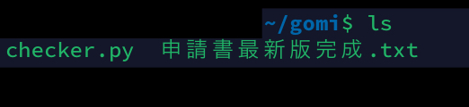
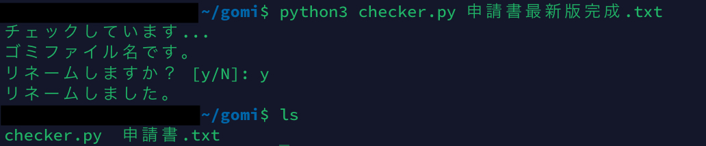

# TrashFileName-Checker
俗に言う、「**ゴミファイル名**」かどうかをチェックします。<br>
万が一、「**ゴミファイル名**」をつけていた場合は、リネームをするか確認してくれます。リネームすると、「**ゴミファイル名**」が取り除かれ、洗練されたファイル名になります。<br>
ゴミ単語のみを使用した、つけるほうが難しい「**ゴミファイル名**」の場合ですと、本ツールを使用することでファイル名が消滅してしまい、よろしくありません。そんな場合は、日付を誰が見ても美しい(?)と言えるフォーマットにして、ファイルに命名します。

## Example
```
👎 Before: 申請書最新版コピー.pdf
   ⏬
👍 After: 申請書.pdf

👎 Before: 重要社外秘.docx
   ⏬
👍 After: 2022-08-06.docx
```

## Screenshots
`申請書最新版完成.txt`というファイルをチェックしてみます。

### Before
~~申請書なのになんで`txt`なんだよという声は心にしまっておいてください。~~



### After
「最新版」「完成」という単語が削除され、洗練されたファイル名になりました。



## Usage
本スクリプトを動かすにはPythonが必要です。お使いの環境にPythonがインストールされているか確認してください。<br>
Pythonさえ、インストールされていればWindows・MacOS・Linuxで動作します。

### ゴミファイル名の場合
```bash
$ python checker.py 申請書最新版コピー.pdf
チェックしています...
ゴミファイル名です。
リネームしますか？ [y/N]: y
リネームしました。
```

### ゴミファイル名ではない場合
```bash
$ python checker.py 申請書.pdf
チェックしています...
ゴミファイル名ではありません。
```
